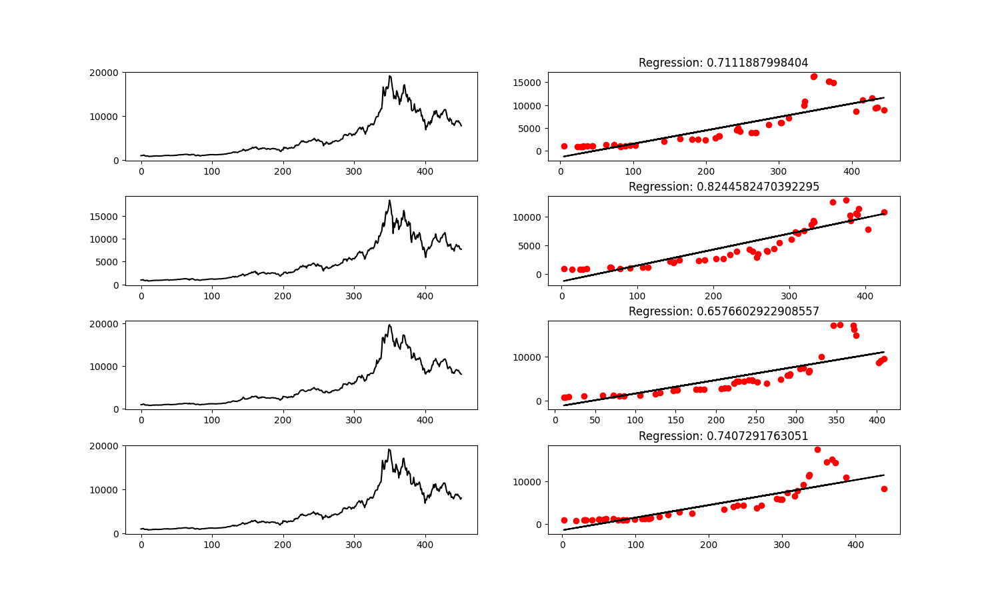
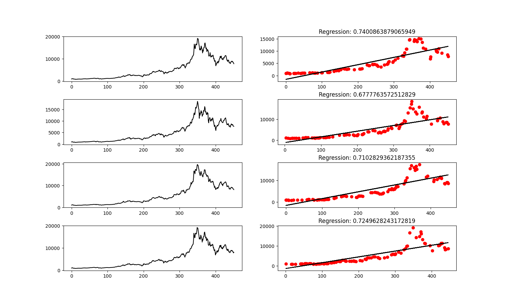
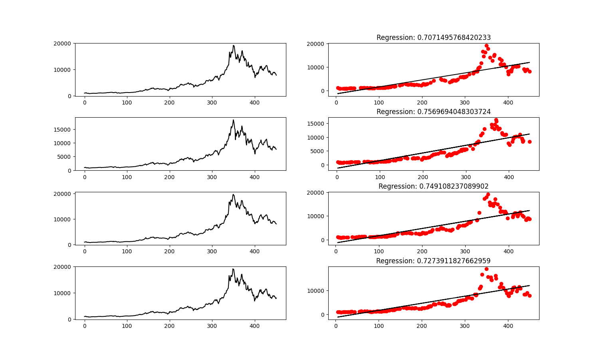

# comparing-btc-price-indicators

### Installation
1. Install Python 3.x
3. Install any other libraries required
4. Run ```if __name__ == '__main__':``` in ```main.py```

### Summary
This project analyzes bitcoin historical data to try and predict the future data and see if we can find what the best indicators are. We use linear regression and create a model that takes data from 2017 to 2019 and splits into training and testing data. I used 3 different testing splits: 10% testing data and 90% training data, 20% testing data and 80% training data, and 30% testing data and 70% training data. 

From these different splits, I analyzed how my model will fit the actual results. I decided to take it a step further and analyze 4 different indicators: open, low, high and close. I thought it would be interesting to see if one of these indicators is better at predicting future prices. These results are below.

### 10% test split


### 20% test split


### 30% test split


### Reflection
As can be seen from the tables, it seems that a testing split of 30% and a training split of 70% seemed to find the best linear regression model. This is probably cause it’s a good balance of the system having enough data but not overfitting. Moreover, it was surprising to see that all 4 indicatorswere more or less the same. This could be due to daily fluctuations being insignificant over the years.

All the testing splits seemed to relay more or less the same information. I think the data set I was working on wasn't large enough which led to a lot of instability and didn't allow me to really test what I wanted to. Had I gotten data from all of bitcoins history, I think my results would have been mor telling.

Also, I think using non-linear regression would have been a lot more usful in analyzing bitcoin as bitcoins trends are obviously non-linear. If I had use non-linear regression, I think my testing scores would have been much higher and this would have been a better prediction algorithm.

### Future
In the future, I would like t see if the time you register a stck price affects how will that stock is a predictor. Maybe ina  future project I will look at this over many different stocks over a long period of time and analyze if one indicator averages to be better than the others. I think this could be the case as more valatile traders tend to trade at different times than people who tarde for a living.

### Resources
* [scikit-learn](https://scikit-learn.org/)
* [numpy](https://numpy.org/)
* [pandas](https://pandas.pydata.org/)
